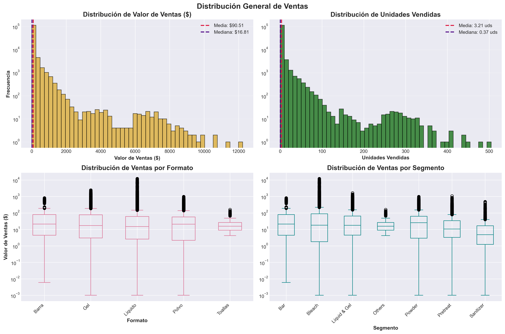
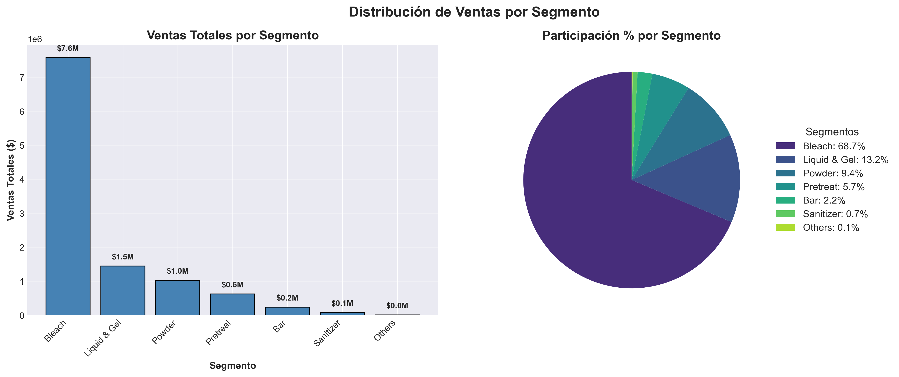
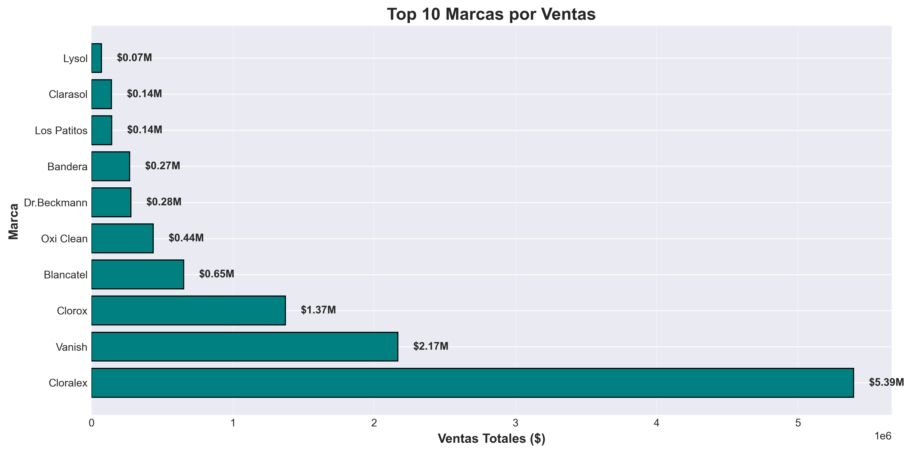
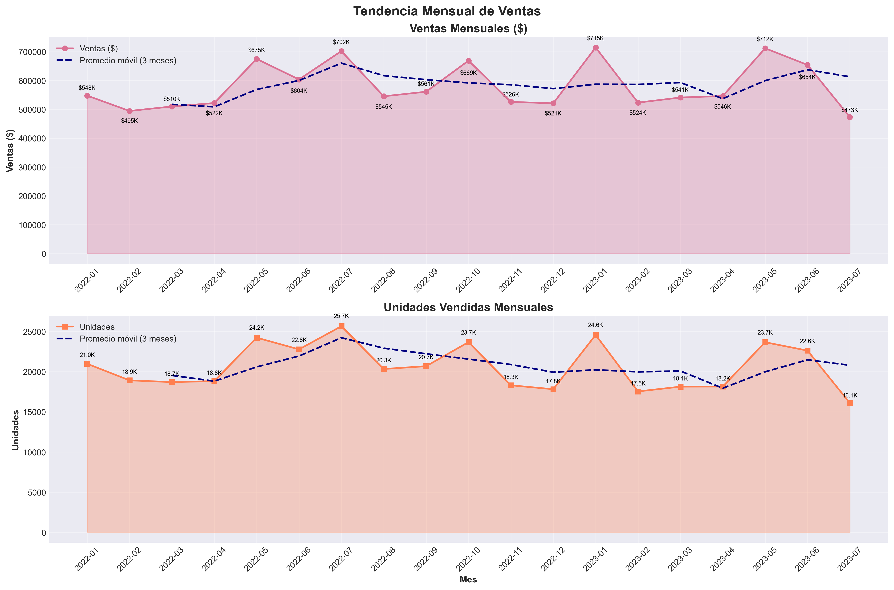
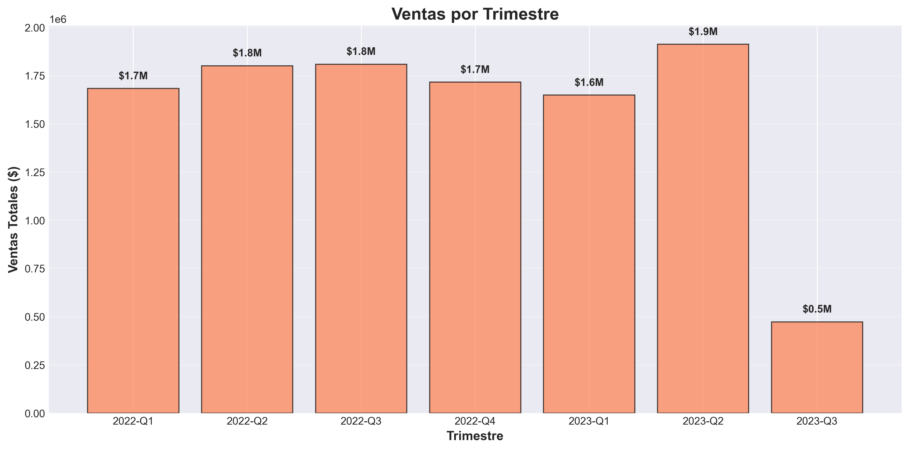
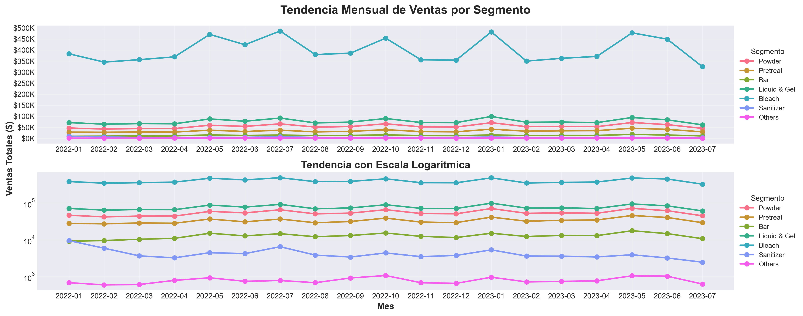
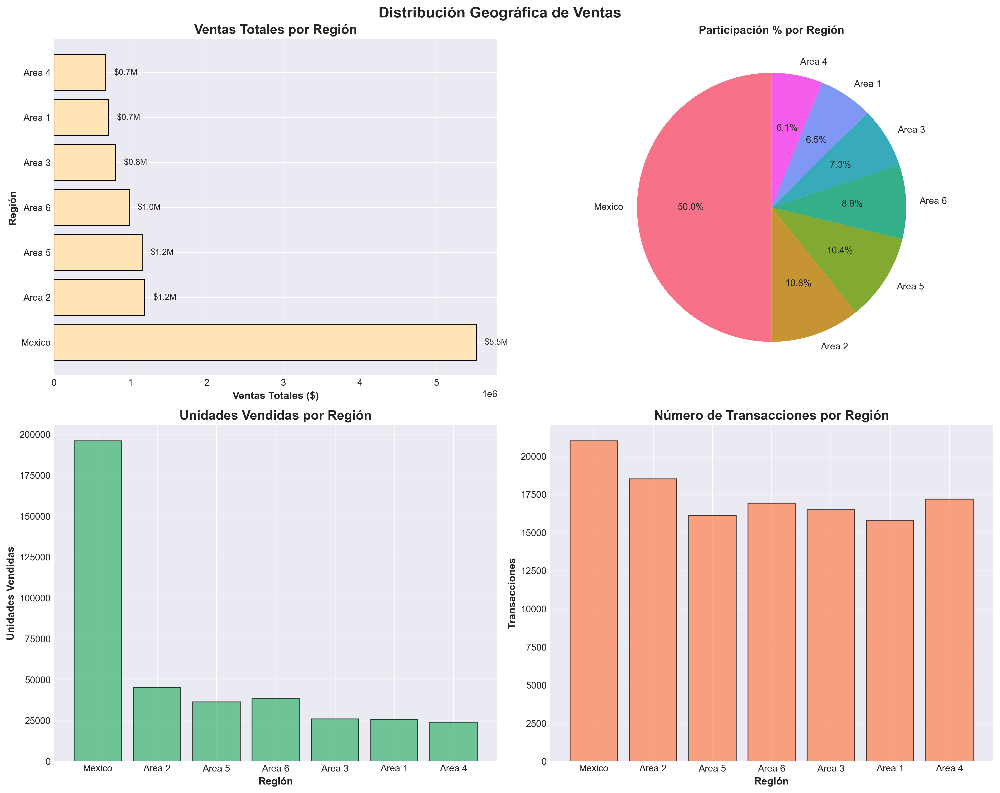
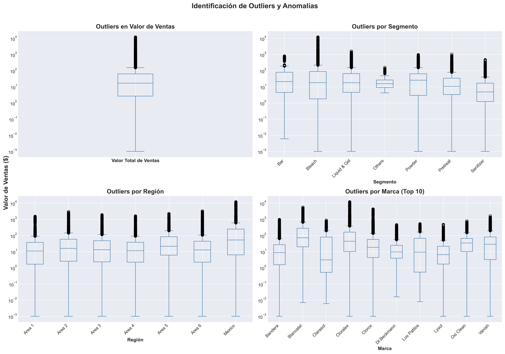
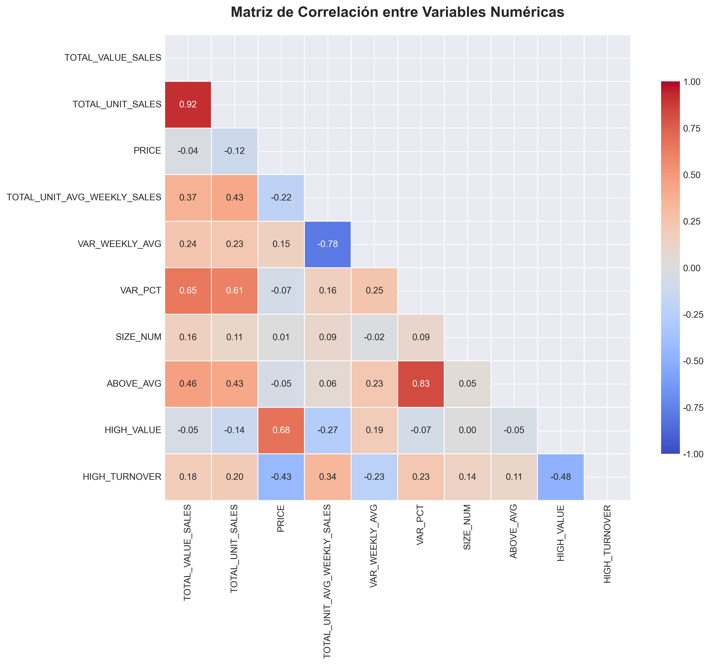
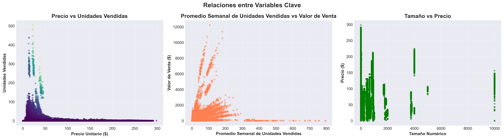

# eda-retail-sales-analysis

# 📊 EDA: Retail Sales Analysis
### Análisis Exploratorio de Datos de Ventas Retail

> **EN** · Exploratory Data Analysis of retail sales data, uncovering 
> trends, patterns, and outliers through statistical visualization.  
> **ES** · Análisis Exploratorio de Datos de ventas retail, identificando 
> tendencias, patrones y valores atípicos mediante visualización estadística.

---

## 📋 Overview / Descripción

**EN** · This project performs a full EDA on a consolidated retail sales 
dataset, analyzing sales distribution, time trends, segment behavior, 
and correlations between key variables.

**ES** · Este proyecto realiza un EDA completo sobre un dataset consolidado 
de ventas retail, analizando distribución de ventas, tendencias temporales, 
comportamiento por segmento y correlaciones entre variables clave.

---

## 🛠️ Tools / Herramientas

---

## 🔍 Analysis Sections / Secciones del Análisis

### 1. Sales Distribution / Distribución de Ventas
- Histograms and boxplots by category, brand, and segment
- Histogramas y boxplots por categoría, marca y segmento

### 2. Time Trends / Tendencias Temporales  
- Monthly and quarterly sales evolution
- Evolución mensual y trimestral de ventas

### 3. Segment Analysis / Análisis por Segmento
- Comparative behavior across customer segments
- Comportamiento comparativo entre segmentos de clientes

### 4. Correlation Analysis / Análisis de Correlaciones
- Relationships between price, units sold, and total value
- Relaciones entre precio, unidades vendidas y valor total

---

## 📊 Key Findings / Hallazgos Principales

### 1. 💰 Sales Overview / Panorama General de Ventas
- **EN** · Total revenue of **$11.04M** across **122,002 transactions** (Jan 2022 – Jul 2023). 
  The large gap between mean ($90.51) and median ($16.81) reveals a market 
  heavily skewed by high-value wholesale transactions and outliers.
- **ES** · Ingresos totales de **$11.04M** en **122,002 transacciones** (ene 2022 – jul 2023). 
  La gran brecha entre la media ($90.51) y la mediana ($16.81) revela un mercado 
  dominado por transacciones mayoristas de alto valor y outliers.

---

### 2. 🎯 Market Concentration Risk / Riesgo de Concentración
- **EN** · The top 3 segments (Bleach, Liquid & Gel, Powder) account for **91.2% of total sales**, 
  with Bleach alone representing **68.7% ($7.6M)**. A single brand — Cloralex — 
  drives **$5.39M (48.9%)** of total revenue, creating significant dependency risk.
- **ES** · Los 3 segmentos principales (Bleach, Liquid & Gel, Powder) concentran el **91.2% de las ventas**, 
  con Bleach representando el **68.7% ($7.6M)** por sí solo. Una sola marca — Cloralex — 
  genera **$5.39M (48.9%)** del ingreso total, creando un riesgo de dependencia significativo.

---

### 3. 📅 Time Trends / Tendencias Temporales
- **EN** · Sales remained relatively stable throughout the period (~$500K–$715K/month), 
  with peak months in **Jul 2022 ($702K)** and **Jan 2023 ($715K)**. 
  No strong seasonality was detected, though a mild upward trend appears in Q2 of each year. 
  Note: Jul 2023 data is incomplete (through day 17 only) and was excluded from trend analysis.
- **ES** · Las ventas se mantuvieron relativamente estables (~$500K–$715K/mes), 
  con picos en **jul 2022 ($702K)** y **ene 2023 ($715K)**. 
  No se detectó estacionalidad marcada, aunque se observa una leve tendencia al alza en Q2 de cada año. 
  Nota: los datos de jul 2023 son incompletos (solo hasta el día 17) y fueron excluidos del análisis de tendencias.

---

### 4. 🗺️ Geographic Anomaly / Anomalía Geográfica
- **EN** · Mexico region dominates with **50% of total revenue ($5.5M)** and an average ticket of **$263.05**, 
  compared to $39–$71 in other areas. Critically, Area 2 has a similar transaction count to Mexico 
  (~18K vs ~21K) but generates **4.6x less revenue** — suggesting a structural difference 
  in purchase size or product mix, not in customer volume.
- **ES** · La región México domina con el **50% del ingreso total ($5.5M)** y un ticket promedio de **$263.05**, 
  frente a $39–$71 en otras áreas. De forma crítica, el Área 2 tiene un número de transacciones 
  similar a México (~18K vs ~21K) pero genera **4.6x menos ingresos** — lo que sugiere 
  una diferencia estructural en el tamaño de compra o mezcla de producto, no en volumen de clientes.

---

### 5. ⚠️ Outliers & Anomalies / Outliers y Anomalías
- **EN** · **14,241 transactions (11.67%)** were identified as outliers, with a maximum sale of $12,236.76. 
  The majority of high-value outliers originate from the Bleach segment and the Mexico region, 
  consistent with the wholesale purchasing pattern identified in the distribution analysis.
- **ES** · **14,241 transacciones (11.67%)** fueron identificadas como outliers, con una venta máxima de $12,236.76. 
  La mayoría de los outliers de alto valor provienen del segmento Bleach y la región México, 
  consistente con el patrón de compra mayorista identificado en el análisis de distribución.

---

### 6. 📈 Price Elasticity / Elasticidad de Precio
- **EN** · Sales value and units sold show a **strong positive correlation (0.92)**. 
  Scatter plots confirm classic elastic behavior: high unit volumes (>100 units) 
  only occur at very low unit prices (<$50), indicating a price-sensitive, 
  volume-driven market dynamic — typical of commodity cleaning products.
- **ES** · El valor de venta y las unidades vendidas muestran una **correlación positiva fuerte (0.92)**. 
  Los gráficos de dispersión confirman un comportamiento elástico clásico: los volúmenes altos 
  de unidades (>100 uds) solo ocurren a precios unitarios muy bajos (<$50), indicando una 
  dinámica de mercado sensible al precio y orientada al volumen — típica de productos de limpieza tipo commodity.

---

### 7. 💡 Strategic Recommendations / Recomendaciones Estratégicas
- **Diversification** · Launch targeted campaigns for Powder and Liquid & Gel segments 
  to reduce over-reliance on Cloralex/Bleach. / 
  Impulsar campañas para Powder y Liquid & Gel para reducir la dependencia de Cloralex/Bleach.
- **Ticket Growth** · Implement cross-selling and bundle strategies in Areas 1–6 
  to increase average transaction value. / 
  Implementar estrategias de cross-selling y bundles en Áreas 1–6 para aumentar el ticket promedio.
- **Data Integrity** · Exclude July 2023 from annual financial projections 
  to avoid downward bias in forecasts. / 
  Excluir julio 2023 de las proyecciones financieras anuales para no sesgar los pronósticos a la baja.

---

## 📁 Repository Structure / Estructura

\`\`\`
eda-retail-sales-analysis/
├── notebook/
│   └── eda_retail_sales.ipynb
├── images/
│   ├── 01_distribucion_ventas.png
│   ├── 02_ventas_por_segmento.png
│   ├── 03_ventas_por_marca.png
│   ├── 04_tendencia_temporal.png
│   ├── 05_ventas_trimestre.png
│   ├── 06_tendencia_por_segmento.png
│   ├── 07_matriz_correlacion.png
│   ├── 08_scatter_plots.png
│   ├── 09_distribucion_geografica.png
│   └── 10_outliers.png
├── README.md
└── requirements.txt
\`\`\`

---

*Project developed as part of the Data Scientist Certificate · 
Proyecto desarrollado como parte del certificado Científico de Datos — EBAC (2025)*
