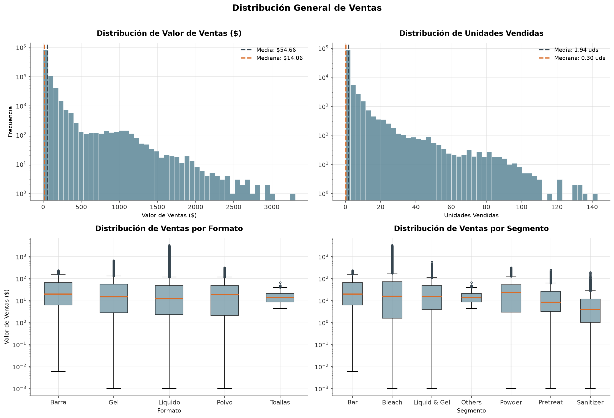
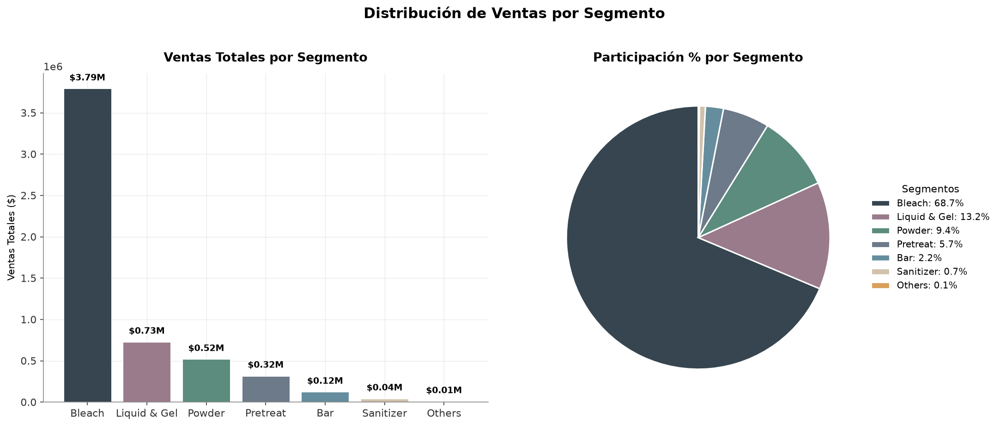
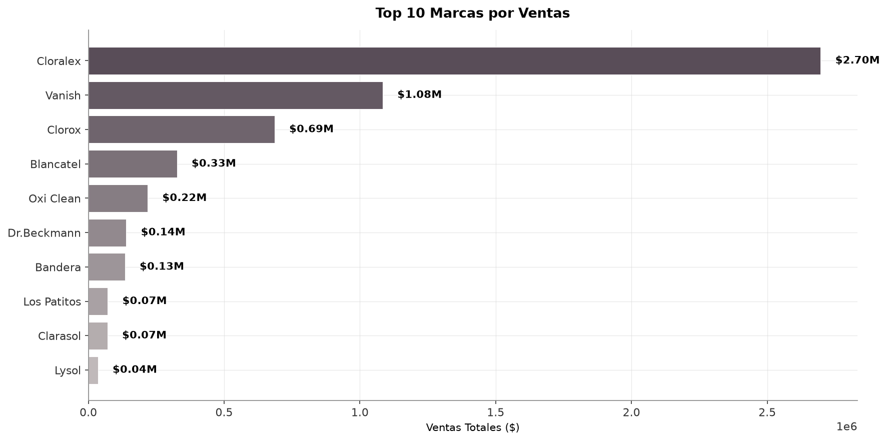
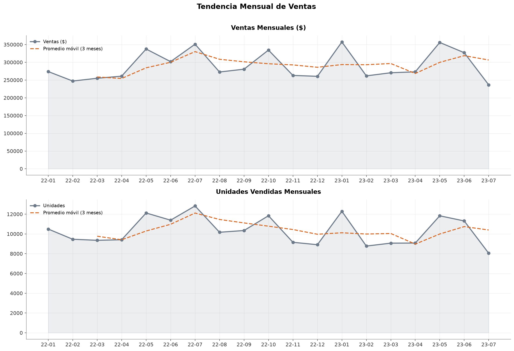
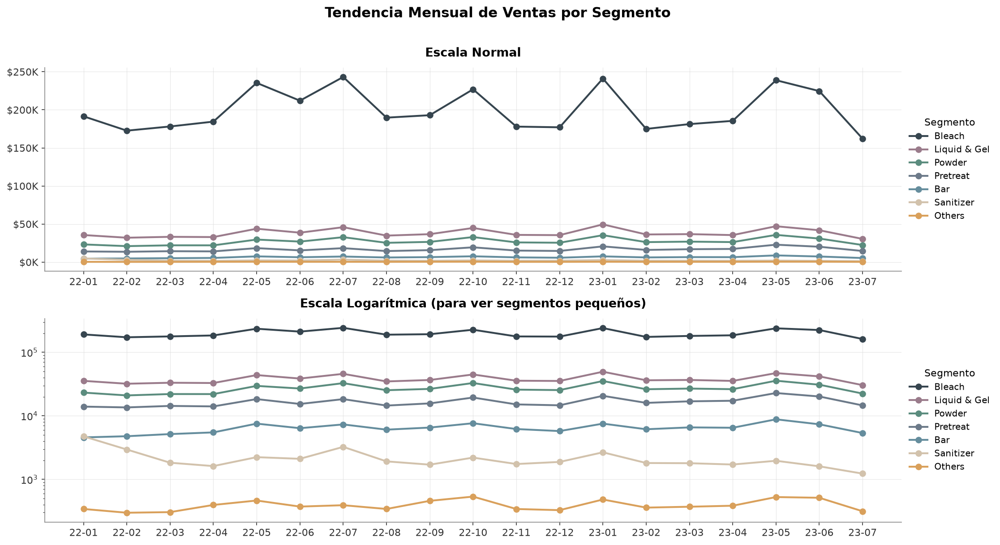
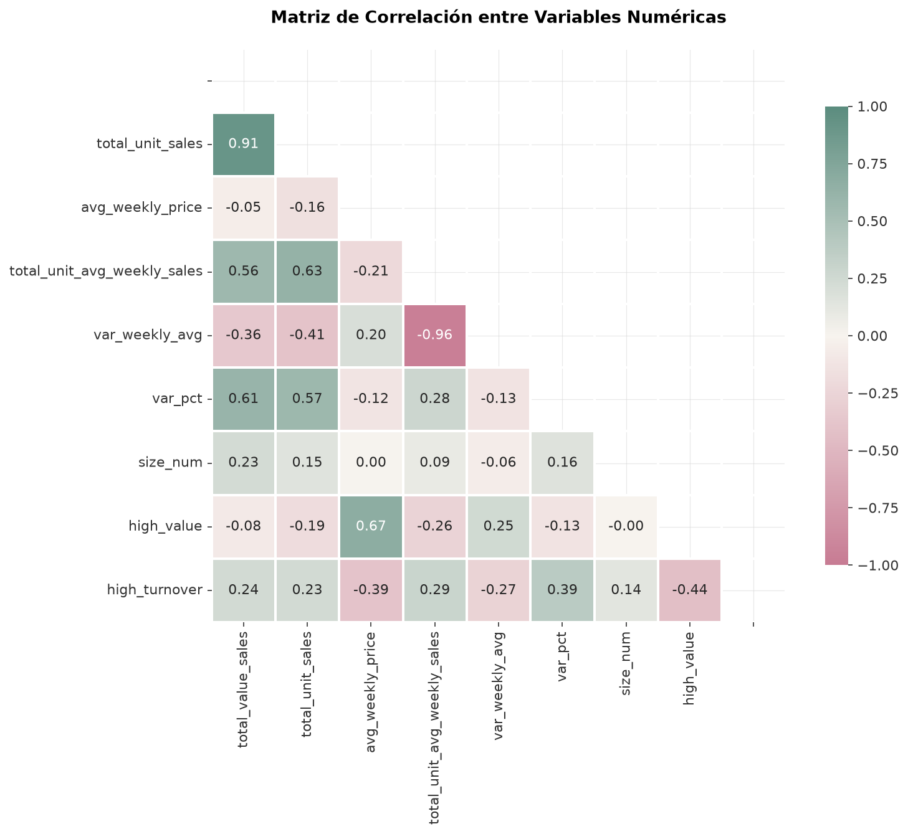
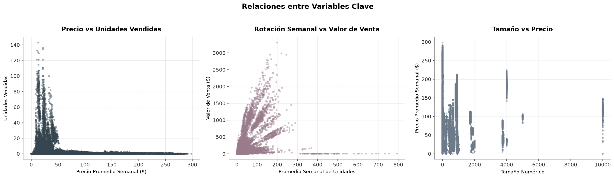
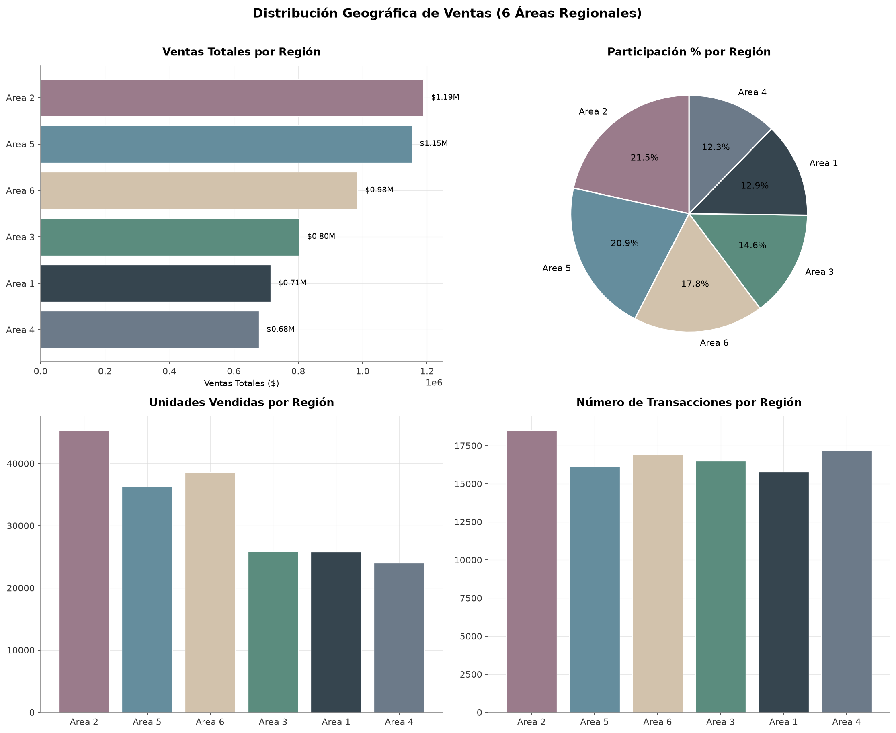
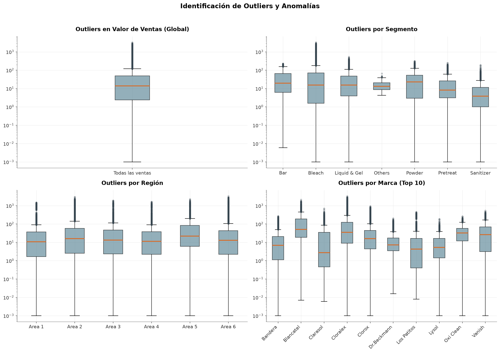

#  Exploratory Data Analysis: Retail Sales Patterns
### Análisis Exploratorio de Datos: Patrones de Venta

> **EN** · Exploratory data analysis of retail sales data, uncovering concentration, seasonality, correlation, and geographic patterns through ten custom visualizations built on a shared design system.
> 
> **ES** · Análisis exploratorio de datos de ventas retail, identificando patrones de concentración, estacionalidad, correlación y distribución geográfica a través de diez visualizaciones con un sistema de diseño propio.

---

##  Overview / Descripción

**EN** · This project continues the [ETL pipeline](https://github.com/ReginaPema/etl-sales-data-cleaning) for retail sales data, taking the consolidated dataset (122,002 weekly sales records, 2022-2023) and applying exploratory analysis to answer concrete business questions: what drives sales concentration, how demand moves through the year, which variables actually correlate with revenue, and where statistical outliers come from.

**ES** · Este proyecto continúa el [pipeline ETL](https://github.com/ReginaPema/etl-sales-data-cleaning) de datos de venta retail, tomando el dataset consolidado (122,002 registros de venta semanal, 2022-2023) y aplicando análisis exploratorio para responder preguntas de negocio concretas: qué impulsa la concentración de ventas, cómo se mueve la demanda a lo largo del año, qué variables realmente correlacionan con el ingreso, y de dónde vienen los outliers estadísticos.

## Methodological Note / Nota Metodológica

**EN** · The dataset includes, alongside the six regional sales areas, a **national total** row that is the aggregated sum of those six areas. This entire analysis works exclusively with the six regional areas (101,012 of the 122,002 total rows), so that no statistic mixes an individual observation with an aggregate.

**ES** · El dataset incluye, junto a las seis áreas regionales de venta, una fila de **total nacional** que es la suma agregada de esas seis áreas. Todo este análisis trabaja únicamente sobre las seis áreas regionales (101,012 de las 122,002 filas totales), para que ninguna estadística mezcle una observación individual con un agregado.

---

##  Tools / Herramientas

---

##  Key Findings / Hallazgos Principales

### 1. Sales Overview / Panorama General de Ventas

- **EN** · Total revenue of **$5.52M** across **101,012 transactions** (Jan 2022 - Jul 2023, area-level data only). The gap between mean ($54.66) and median ($14.06, close to 4x) reveals a market heavily skewed by high-value wholesale transactions.
- **ES** · Ingresos totales de **$5.52M** en **101,012 transacciones** (ene 2022 - jul 2023, solo datos a nivel área). La brecha entre la media ($54.66) y la mediana ($14.06, casi 4x) revela un mercado con fuerte sesgo por transacciones mayoristas de alto valor.

---

### 2. Market Concentration Risk / Riesgo de Concentración

- **EN** · The top 3 segments (Bleach, Liquid & Gel, Powder) account for **91.2% of total sales**, with Bleach alone representing **68.6% ($3.79M)**. A single brand, Cloralex, drives **$2.70M (48.8%)** of total revenue, more than double the second-place brand.
- **ES** · Los 3 segmentos principales (Bleach, Liquid & Gel, Powder) concentran el **91.2% de las ventas**, con Bleach representando el **68.6% ($3.79M)** por sí solo. Una sola marca, Cloralex, genera **$2.70M (48.8%)** del ingreso total, más del doble que la segunda marca.

---

### 3. Seasonal Pattern / Patrón Estacional

- **EN** · Sales follow a consistent seasonal pattern across both years: **May** as the strongest month and **February** as the weakest, in both 2022 and 2023. July 2023 data is incomplete (through day 17 only) and was excluded from any month-over-month comparison.
- **ES** · Las ventas siguen un patrón estacional consistente en ambos años: **mayo** como el mes más fuerte y **febrero** como el más débil, tanto en 2022 como en 2023. Los datos de julio 2023 están incompletos (solo hasta el día 17) y se excluyeron de cualquier comparación mes a mes.

---

### 4. Volume-Driven Growth / Crecimiento Impulsado por Volumen

- **EN** · Sales value and units sold show a **strong positive correlation (0.91)**, while price shows no meaningful correlation with total revenue. Scatter plots confirm the pattern: unit volumes above 100 only occur at low unit prices, consistent with a volume-driven, price-sensitive market rather than one built around premium pricing.
- **ES** · El valor de venta y las unidades vendidas muestran una **correlación positiva fuerte (0.91)**, mientras que el precio no muestra correlación relevante con el ingreso total. Los gráficos de dispersión confirman el patrón: los volúmenes por encima de 100 unidades solo ocurren a precios bajos, consistente con un mercado impulsado por volumen y sensible al precio, no uno construido sobre precio premium.

---

### 5. Balanced Regional Distribution / Distribución Regional Equilibrada

- **EN** · Performance across the six regional areas is reasonably balanced: Area 2 leads with 21.5% of sales, and average ticket size varies by 1.8x between the strongest and weakest areas (not the 6-7x gap a naive comparison against an unfiltered aggregate would suggest).
- **ES** · El desempeño entre las seis áreas regionales es razonablemente parejo: Área 2 lidera con 21.5% de las ventas, y el ticket promedio varía 1.8x entre el área más fuerte y la más débil (no la brecha de 6-7x que sugeriría una comparación ingenua contra un agregado sin filtrar).

---

### 6. Outliers & Anomalies / Outliers y Anomalías

- **EN** · **10,022 transactions (9.92%)** were identified as statistical outliers via the IQR method, with values consistent across all six regions (no single area concentrates them disproportionately). Separately, **410 records** show near-zero sales value and are flagged for data quality review rather than treated as legitimate transactions.
- **ES** · **10,022 transacciones (9.92%)** fueron identificadas como outliers estadísticos vía el método IQR, con valores consistentes entre las seis regiones (ninguna área los concentra de forma desproporcionada). Por separado, **410 registros** muestran valor de venta casi nulo y se marcan para revisión de calidad de datos, no como transacciones legítimas.

---

##  Strategic Recommendations / Recomendaciones Estratégicas

- **Diversification / Diversificación**:
  > Grow Liquid & Gel and Powder to reduce dependency on Bleach/Cloralex. / Impulsar Liquid & Gel y Powder para reducir la dependencia de Bleach/Cloralex.
- **Data Integrity / Integridad de Datos**:
  > Exclude July 2023 from annual projections; review the 410 near-zero records before using them in financial reporting. / Excluir julio 2023 de proyecciones anuales; revisar los 410 registros casi nulos antes de usarlos en reportes financieros.
- **Regional Playbook / Manual Regional**:
  > Use Area 2 and Area 5 (strongest ticket and volume combined) as a reference for improving lower-performing areas. / Usar Área 2 y Área 5 (mejor ticket y volumen combinados) como referencia para mejorar las áreas de menor desempeño.

---

##  Repository Structure / Estructura

    eda-sales-analysis/
    ├── notebook/
    │   └── eda_sales_analysis.ipynb
    ├── images/                         # 10 exported visualizations
    ├── README.md
    └── requirements.txt                # Python libraries

---

*Project developed as part of the Data Scientist Certificate · 
Proyecto desarrollado como parte del certificado Científico de Datos — EBAC (2025)* 
